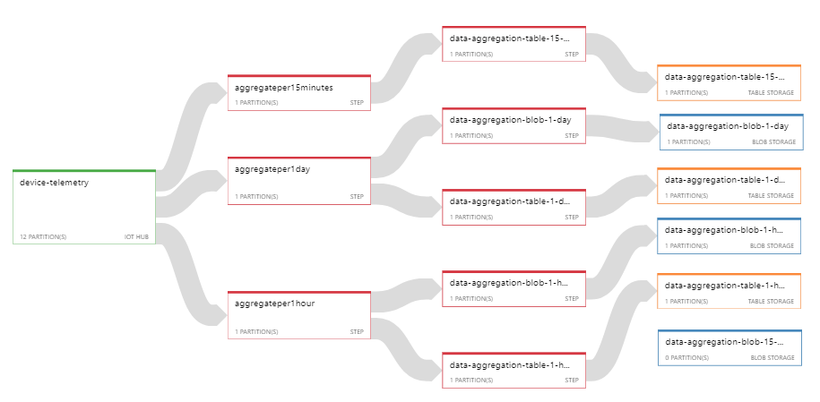

# Connected Car

Website for the Codit connected car that is being used in The Barrel Challenge 2018

# Architecture Overview
The car sends all telemetry to Azure IoT Hub via Nebulus&trade; as a field gateway. Once it arrives in Azure IoT Hub we split the processing in two parts:
1. Near-Real-Time aggregation
2. Push events to Azure Service Bus Topics that gives us the ability to hook in where we want

## Real-Time Aggregation
For our real-time aggregation we use Azure Stream Analytics that will create aggregates based on the device message stream in Azure IoT Hub.

The job will output this for the following intervals:
- Every 15 minutes
- Every Hour
- Every Day

We have Azure Table Storage & Azure Blob Storage configured as sinks for this.

## Event Extensibility
We use functions to have small extensibility points:
1. A function to archive all our events to Azure Table Storage
2. A function that pushes events to our frontend via SignalR

# Configuration
## Backend
1. Setup a table storage in Azure and copy the connection string.
2. Replace the `<CHANGEME>` value for the `TelemetryStorage.ConnectionString` setting in `appsetings.json` with the table storage connection string.
3. Generate a random string [here](https://www.random.org/strings/) for the API key (this is used by the `RealTime` Azure function to communicate with the frontend).
4. Replace the `<CHANGEME>` value for the `Authorization.ApiKey` in the API and the `RealTimeApiKey` setting in the functions project with this random API key
4. Replace the `<CHANGEME>` value for the `AzureWebJobsStorage` in the functions project with the connection string to your Azure Storage account for hosting the functions
4. Replace the `<CHANGEME>` value for the `ConnectedCarServiceBus` in the functions project with the connection string to your Service Bus namespace
4. Replace the `<CHANGEME>` value for the `ConnectedCarTableStorage` in the functions project with the connection string to your Azure Storage account

## Frontend
1. Get a Google Maps key here (https://developers.google.com/maps/documentation/javascript/get-api-key)
2. Open `environment.ts` and replace the `<CHANGEME>` value for the `mapKey` setting.

# Running it locally
1. Go to the `src/frontend` folder.
2. Make sure all npm packages are installed by running `npm install` or `yarn`.
3. Run `ng build --prod`.
2. Go to the `src/backend` folder and run `dotnet build --runtime debian-x64`.
3. Publish the backend by running `dotnet publish --runtime debian-x64`.
4. Go back to the root folder of the project.
5. Run `docker build -f '.\docker\dev.dockerfile' -t <imagename> .` to build the docker image. (Replace <imagename> with a name for the Docker image).
6. Start the container by running `docker run -p <port>:80 -t <imagename> (Replace <port> with the port you want to service to be available at & replace <imagename> with the name you used from the previous step).
